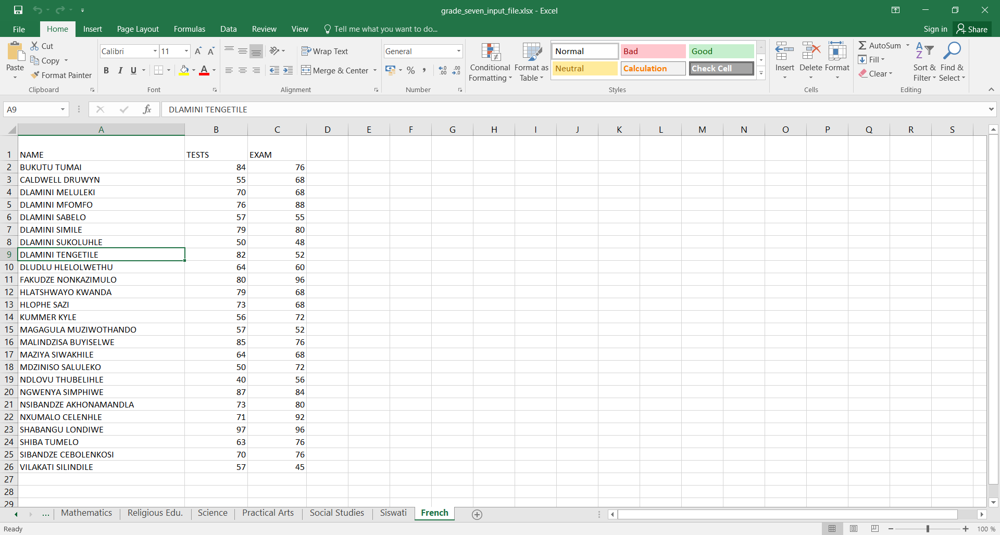

# Student-Report-Generator
---
## The Little Primary School Report Generator

Student Report Generator is a simple desktop application that allows teachers from the __Little Primary School, Pinevalley, Mbabane Eswatini__ to automate the process of creating their students' reports.

## Input File

The program takes a __.xlsx__ file constituting the following details:
 * __Each sheet is a specific subject to be recorded, with:__
    * __Students' names__
    * __Tests and Exams marks__

See the screen shot below:

## File Processing

On reading a __.xlsx__ in the required format(as shown above), the program does the following while there are sheets to read:
   * Reads each sheet (subject) and while there are non-empty rows:
      * The program goes through each column, associating the columns as follows:
      
             1 The first column with student's name
             2 The second up to  (n-1)th column with tests (i.e test 1, test 2,....., test n)
             3 The last column with the exam mark
             
   * For each student's name and respective subject, the program does the following:
      * The average of all the tests is computed
      * The exam mark is read
      * The term mark is computed as a ratio __2:3__ of term tests' average and exam mark respectively.
      * Remarks on each subject is determined by the term mark.
      * The overall term average mark is computed to determine the scale (i.e Merit, or First, etc)
      * A .__docx__ file is created and populated with these results
      
## User Interface

Users (teachers) interact with the application using a tiny GUI with one button which they will to navigate their computer to find the input file. On opening the file, they are prompted to input the class grade and next term's opening date (since this information is generic for all the reports).

See the screen short below shows how the GUI looks like:

## Output File

On creating a __.docx__ file for each student, the program does the following:
   * Inserts a header section with the school's name and address on the file
   * Adds student's name, grade level, and next term's opening date
   * Adds a table where the number of rows is the number of subjects plus three rows for heading, totals and averages (depicted below)
   * Appends a section for the student's scale
   * Finally adds the comments section

The screen shot below show how a report of some student how
